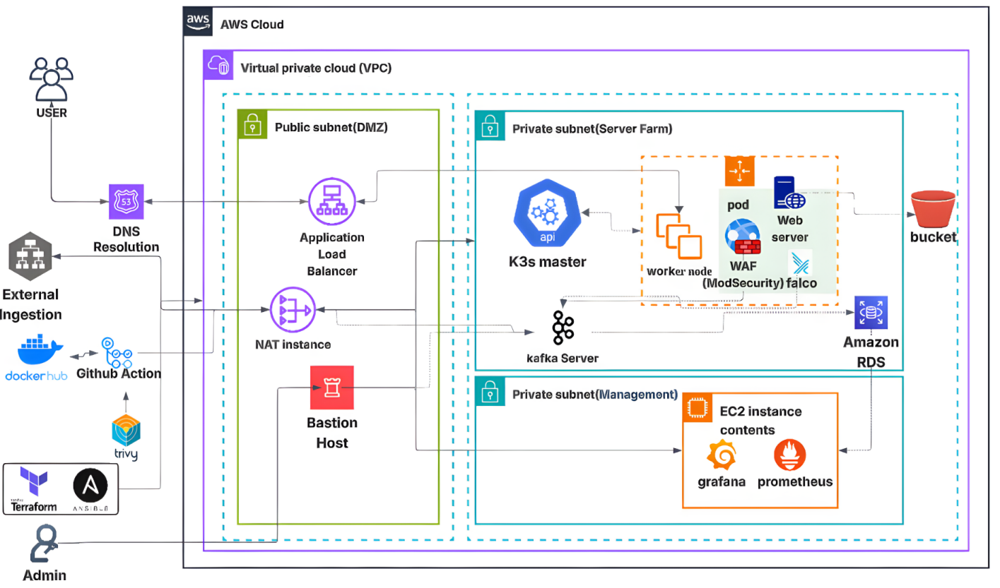
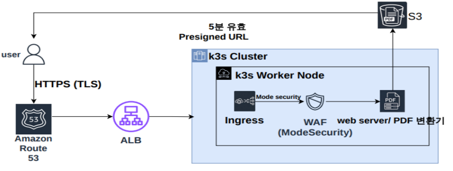
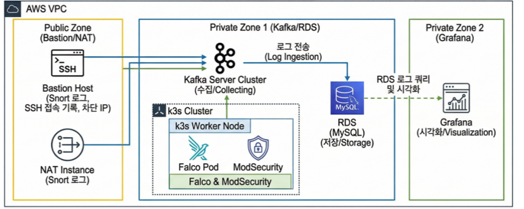

# SixthSense : 오픈소스 기반 클라우드 네이티브 통합 보안 플랫폼

## 1. 프로젝트 개요
**SixSense**는 중소기업의 보안 투자 부담을 최소화하면서도 실질적인 방어 능력을 갖출 수 있도록 설계된 **'오픈소스 기반 클라우드 네이티브 통합 보안 플랫폼'**입니다. 클라우드 인프라 프로비저닝부터 애플리케이션 배포, 보안 관제까지 전 과정을 코드로 자동화(IaC/GitOps)하여 지속 가능한 보안 운영 모델을 제시합니다.

* **오픈소스 및 무료 티어 적극 활용 :** 라이선스 비용을 절감하고 커뮤니티 기반의 강력한 보안 도구(Snort, Falco 등) 통합
* **실시간 모니터링 :** 24시간 자동화된 위협 탐지 및 로그 분석을 통한 이상 징후 감지 (Prometheus & Grafana)
* **경제적이고 유연한 인프라 :** AWS 클라우드 환경과 K3s(경량 쿠버네티스)를 조합하여 최소한의 투자로 최대의 가용성 확보

---

## 2. 기술 스택 (Tech Stack)

### 인프라 및 오케스트레이션 (Infrastructure & Orchestration)
* **Cloud:** AWS (VPC, EC2, ALB, RDS, S3)
* **IaC & Automation:** Terraform, Ansible
* **Container & Orchestration:** K3s (Lightweight Kubernetes)
* **Message Broker:** Apache Kafka
* **CI/CD:** GitHub Actions, ArgoCD

### 백엔드 및 문서 처리 엔진 (Backend & Document Engine)
* **Framework / Language:** FastAPI, Python
* **Document Processing:** LibreOffice, Ghostscript, Pillow (이미지 처리)

### 보안 및 통합 관제 (Security & Monitoring)
* **Security Tools:** Aqua Trivy (컨테이너 보안), Snort (네트워크 IDS), Falco (런타임 보안), ModSecurity (WAF)
* **Monitoring:** Prometheus, Grafana

## 3. 팀원 소개 및 역할 (Contributors)

| 이름 | 역할 및 담당 업무 |
| :---: | :--- |
| 김경호  | - 로그 실시간 백업 구축   - 보안 관제 환경 구축   |
| 김건  | - 인프라 환경 구축   - 백업 복구 환경 구축   |
| 김지효  | - CI/CD 구축   - 쿠버네티스 환경 구성   |
| 양성호  | - CI/CD 구축   - 컨테이너 보안 점검 툴 적용   |
| 유준수  | - 인프라 환경 구축   - 웹 서비스 개발   |
| 이호석  | - 보안 정책 수립   - 침입 차단(IPS) 구현 및 구축   |

## 4. 아키텍처 (Architecture)

  
    
  
    
  
    
  

